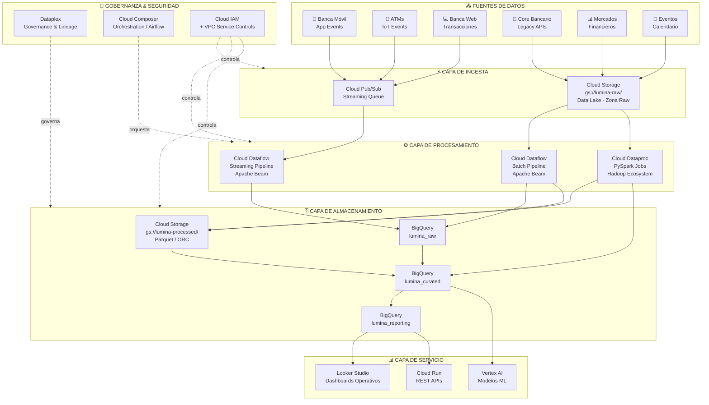
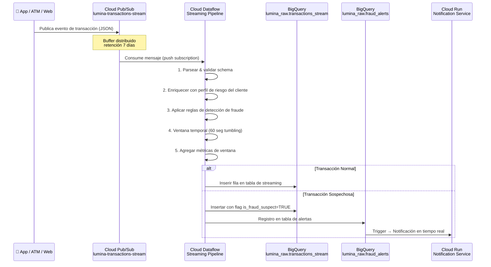
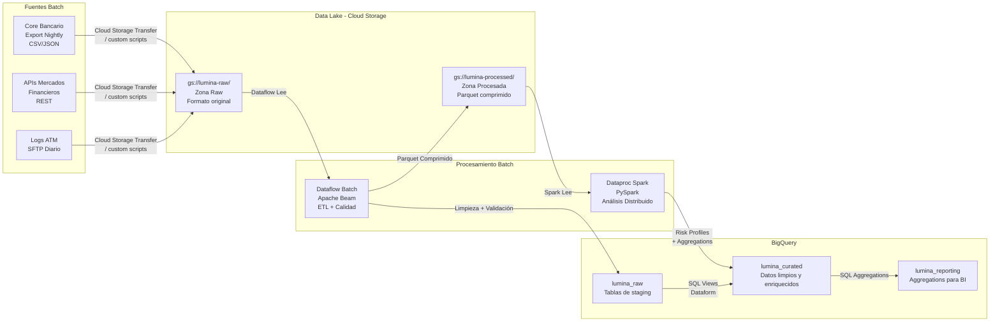
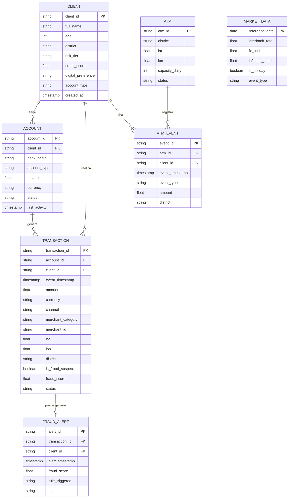
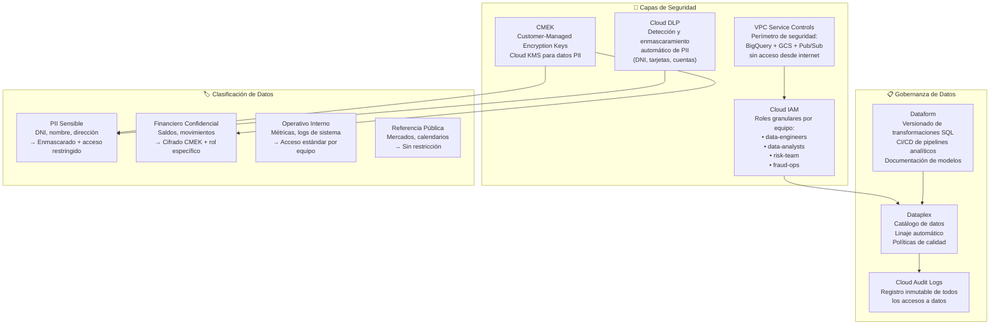
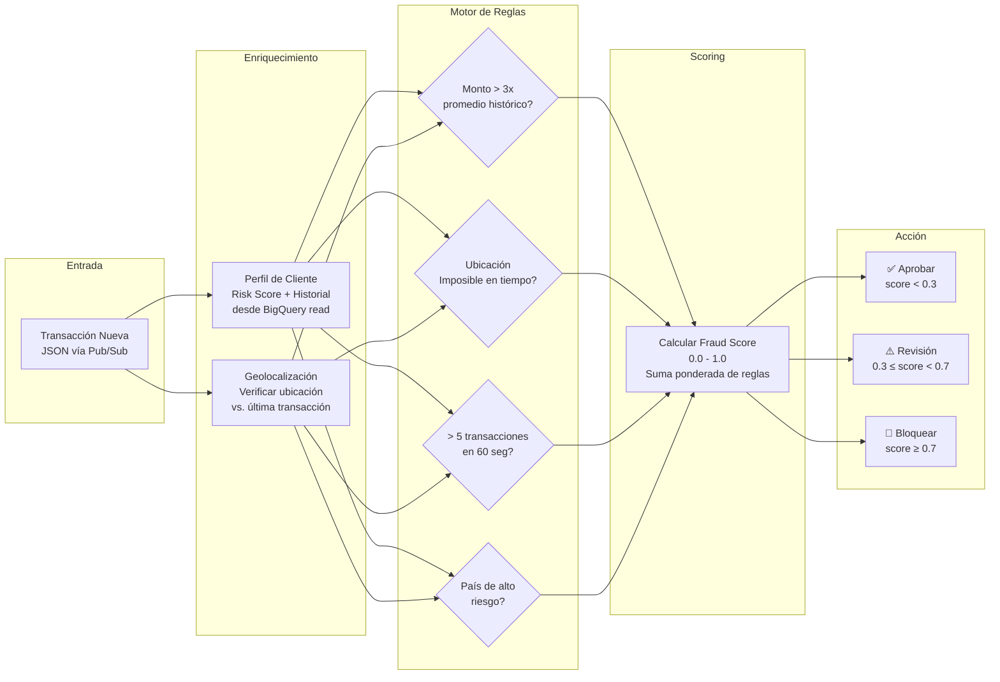
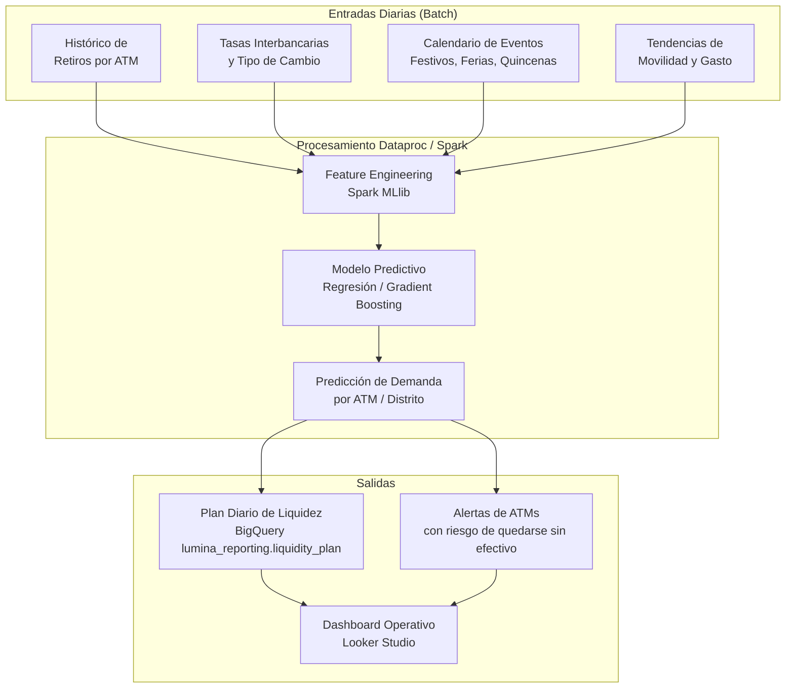
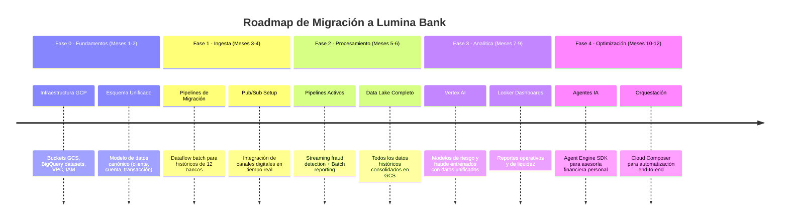

# Arquitectura Big Data: Lumina Bank
## CS8087 – Big Data | Maestría en Ciencia de Datos e IA | UTEC

> **Proyecto:** Taller de Arquitectura Big Data – DataBank Metropolitan  
> **Rol asumido:** Principal Data Architect  
> **GCP Project:** `project-b028d063-61aa-48a0-ad5`  
> **Fecha:** Marzo 2026

---

## 1. Contexto y Problemática

**Lumina Bank** nace de la unificación de 12 entidades bancarias independientes en la región de **DataLandia**, bajo la **Iniciativa Financiera Lumina** (aprobada 2024). Gestiona más de **9 millones de clientes** distribuidos en 8 distritos financieros.

### Desafíos Principales (Pain Points)

| # | Pain Point | Impacto |
|---|---|---|
| 1 | **Fragmentación de datos** | 12 entidades con silos de datos incompatibles; imposible hacer fraud prevention cross-entidad |
| 2 | **Latencia en picos de carga** | Congestión en días de pago; retrasos en validación de transacciones |
| 3 | **Ausencia de última milla digital** | 89% de clientes cerca de ATM/oficina, pero el sistema no los conecta inteligentemente |
| 4 | **Brecha demográfica** | Adultos mayores vs. nativos digitales: la oferta no se adapta al perfil del usuario |
| 5 | **Sin perfilamiento de riesgo unificado** | Detección de fraude reactiva e independiente por banco |
| 6 | **Sin planificación de liquidez predictiva** | Demanda de efectivo estimada manualmente, sin datos de mercado o eventos |

---

## 2. Filosofía de Diseño

La arquitectura adoptada es **Lambda Architecture** adaptada al ecosistema GCP, combinando:

- **Hot Path (Velocidad):** Procesamiento de eventos en tiempo real para decisiones críticas como fraude y autorización de transacciones (latencia < 2 segundos).
- **Cold Path (Volumen):** Procesamiento batch de grandes volúmenes históricos para analítica, planificación de liquidez, e informes operativos.
- **Serving Layer:** BigQuery como capa única de consulta analítica para ambos caminos.

### Principios de Diseño

1. **Cloud-native y serverless primero** → menor overhead operativo
2. **Open source prioritario** → Apache Beam, Apache Spark (Hadoop ecosystem), formato Parquet/ORC
3. **Separación de cómputo y almacenamiento** → escalabilidad independiente
4. **Datos como activo de Lumina Bank** → Data Lake centralizado en GCS, propiedad de los datos
5. **Seguridad y gobernanza desde el diseño** → cifrado en tránsito y reposo, IAM granular, lineage de datos

---

## 3. Arquitectura General: Vista de Alto Nivel

---

## 4. Arquitectura de Datos Detallada

### 4.1 Flujo de Ingesta (Hot Path – Streaming)

### 4.2 Flujo de Ingesta (Cold Path – Batch)

### 4.3 Modelo de Datos Conceptual

---

## 5. Tecnologías GCP y Justificación

### 5.1 Stack Tecnológico Completo

| Capa | Servicio GCP | Open Source Base | Justificación |
|---|---|---|---|
| **Ingesta Streaming** | Cloud Pub/Sub | – | Cola de mensajes gestionada; desacoplamiento productor/consumidor; escalado automático; retención configurable (hasta 7 días) |
| **Procesamiento Streaming** | Cloud Dataflow | Apache Beam | Modelo unificado batch+stream; serverless (sin gestión de cluster); auto-scaling; exactamente-una-vez garantizado |
| **Procesamiento Batch** | Cloud Dataproc | Apache Spark / Hadoop | Cluster Spark/Hadoop gestionado; ideal para joins masivos sobre históricos; costo-efectivo con preemptible VMs |
| **Data Lake (Raw)** | Cloud Storage (GCS) | – | Almacenamiento de objetos exabyte-scale; bajo costo; soporte nativo de Parquet/ORC; integración directa con Dataflow y Dataproc |
| **Data Warehouse** | BigQuery | – | Motor analítico columnar serverless; consultas SQL sobre petabytes; integración con Looker, Vertex AI y Dataform |
| **Transformación SQL** | Dataform | dbt-like | Versionamiento de transformaciones SQL; linaje de datos; CI/CD para queries analíticas (DataOps) |
| **Orquestación** | Cloud Composer | Apache Airflow | DAGs para pipelines complejos; dependencias entre tareas; reintentos automáticos; visibilidad del flujo |
| **Gobernanza** | Dataplex | – | Linaje de datos automático; catalogación; gestión de políticas de acceso; calidad de datos |
| **ML / IA** | Vertex AI | TensorFlow/PyTorch | Entrenamiento y despliegue de modelos de detección de fraude; Feature Store para reutilización de features |
| **Seguridad** | Cloud IAM + VPC SC | – | Control de acceso granular por rol; Service Controls para aislar datos sensibles; sin exfiltración de datos |
| **Monitoreo** | Cloud Monitoring + Logging | – | Alertas de latencia de pipeline; dashboards de salud de infraestructura |
| **APIs / Microservicios** | Cloud Run | Docker | Microservicios serverless para exponer datos procesados al frontend |

### 5.2 Por Qué NO Kubernetes propio / On-Premise

- **Complejidad operativa**: DataLandia está migrando 12 sistemas legacy → prioridad en time-to-market
- **Elasticidad**: Picos de pago requieren escalado en minutos, no horas
- **Seguridad**: GCP provee compliance bancario (PCI-DSS, SOC 2) sin esfuerzo adicional
- **Costo**: Modelo de pago por uso en Dataflow/BigQuery >> mantener cluster 24/7

---

## 6. Seguridad y Gobernanza

---

## 7. Pipeline de Detección de Fraude (Detalle)

---

## 8. Planificación de Liquidez (Vista General)

---

## 9. Estrategia de Migración desde 12 Bancos

---

## 10. Dimensionamiento Estimado

| Métrica | Estimado | Fuente |
|---|---|---|
| Clientes activos | 9,000,000 | Caso de estudio |
| Transacciones/día (normal) | ~5,000,000 | ~0.5-1 tx/cliente/día |
| Transacciones/día (pico pago) | ~25,000,000 | 5x factor pico |
| Eventos Pub/Sub/seg (pico) | ~300 msg/s | 25M / 86400s |
| Volumen raw diario | ~50-100 GB | ~2KB/evento promedio |
| Volumen histórico (12 bancos, 5 años) | ~180 TB | 100 GB/día × 5 años |
| Tamaño BigQuery estimado (primer año) | ~36 TB | sin compresión |
| Latencia objetivo (fraude) | < 2 segundos | SLA de autorización |
| Latencia objetivo (batch KPIs) | < 2 horas | SLA operativo |

---

## 11. Entregables del Proyecto

| Entregable | Descripción | Archivos |
|---|---|---|
| **E1 (Evaluación)** | Diseño de arquitectura + justificación tecnológica | `architecture.md` |
| **P1 (Pipeline)** | Implementación de ingesta y procesamiento distribuido | `pipelines/`, `data_generation/`, `infra/` |
| **P2 (ML)** | Modelos Vertex AI + RAG | *(futuro)* |
| **P3 (Agente)** | Agente inteligente con Cloud Composer + Cloud Run | *(futuro)* |

---

## 12. Referencias

- [Google Cloud Architecture Center – Financial Services](https://cloud.google.com/architecture/financial-services)
- [Apache Beam Programming Guide](https://beam.apache.org/documentation/programming-guide/)
- [BigQuery Best Practices](https://cloud.google.com/bigquery/docs/best-practices-performance-overview)
- [Ted Malaska & Jonathan Seidman (2018). Foundations for Architecting Data Solutions. O'Reilly.]
- [Google Cloud Pub/Sub Documentation](https://cloud.google.com/pubsub/docs)
- [Cloud Dataproc – Spark/Hadoop](https://cloud.google.com/dataproc/docs)
